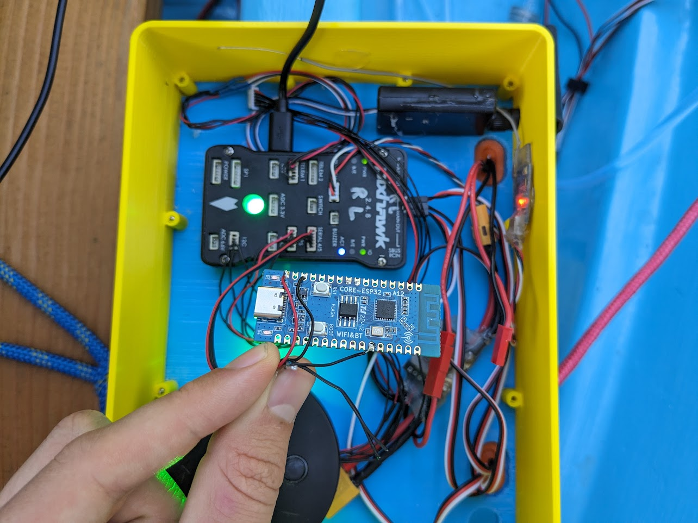

Boat Key
========

Sends mavlink heartbeat packets when a bluetooth tracker is in range. You can configure an ardupilot GCS failsafe to trigger when the heartbeats stop. This can be useful for automatically cutting the throttle to your ardupilot boat when you fall overboard.

## Hardware setup

Buy a ESP32 dev board and wire up +5V, GND and a GPIO. Be careful to buy a ESP32 board with bluetooth - the ESP32C3 variants are good.

Wire this up to telem4/5 on a pixhawk. On the pixhawk telem port, pin 1 is +5v, pin 3 is RX (to GPIO), pin 6 is GND.



## Software setup

Install the espressif ESP32 board package from arduino package manager. Set it to generic ESP32C3 in DIO mode, or whatever you need to match your board. Flash it. Upload to board and use the serial monitor. It will show all of the addresses that it sees. Figure out which is yours and paste the address near the top. Change the TX_PIN, if needed. Reupload.

## Ardupilot setup

These parameters are for Rover 4.2.3. Might be slightly different for other ardupilot configurations:

```
SERIAL4_PROTOCOL 1
FS_GCS_ENABLE 1
FS_TIMEOUT 16
SYSID_MYGCS 0
```

The last one needs some explaining. The GCS failsafe is triggered by a lack of packets coming from a GCS using a certain sysid. Ardupilot GCS's (mission planner, mavproxy, etc) all use 255. But we don't want a connected mission planner instance to prevent the failsafe from happening. So the arduino code sends the eartbeat with component ID 0, and setting SYSID_MYGCS=0 means that these heartbeats are used for failsafes.